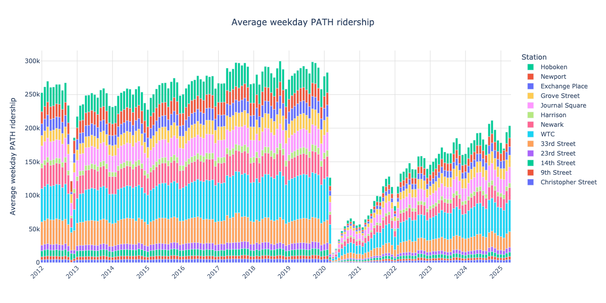
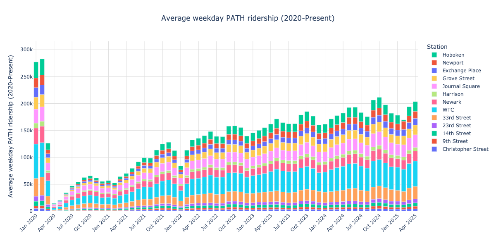
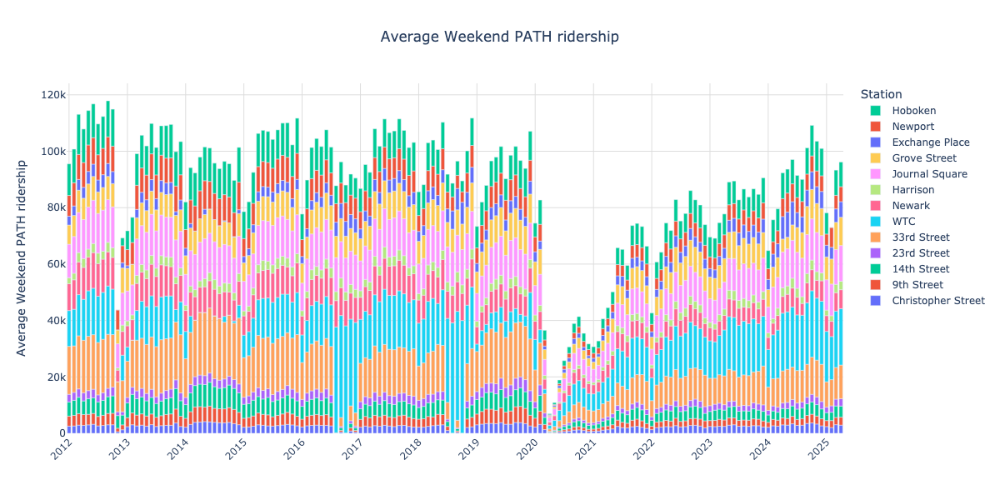
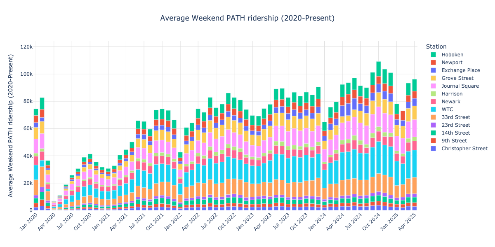
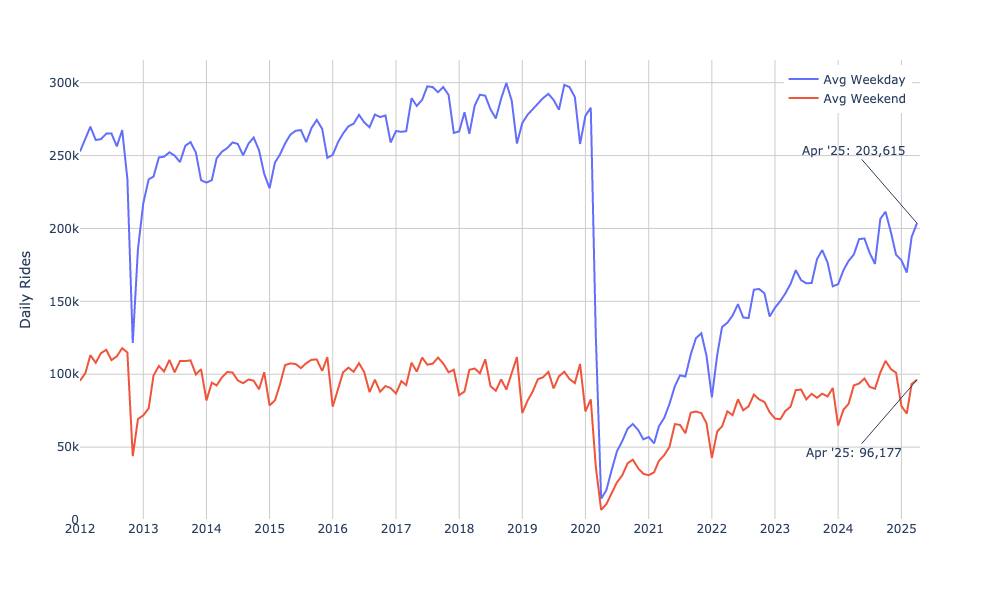
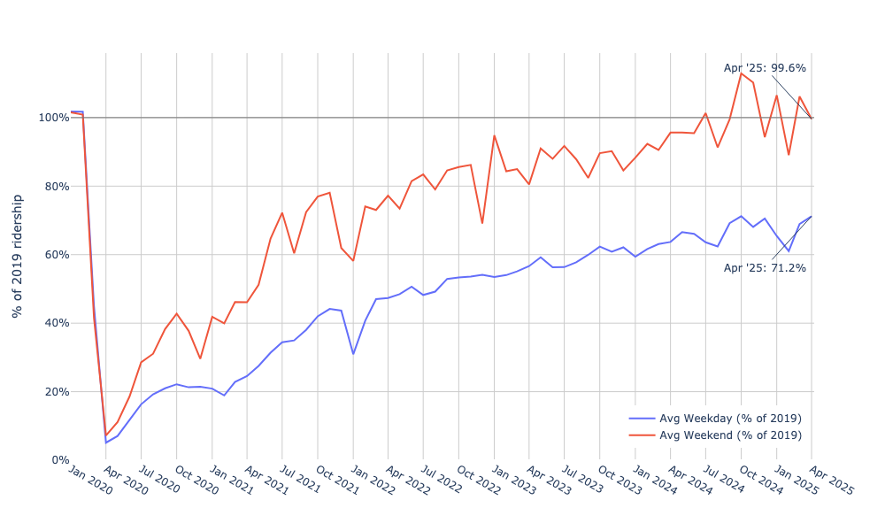
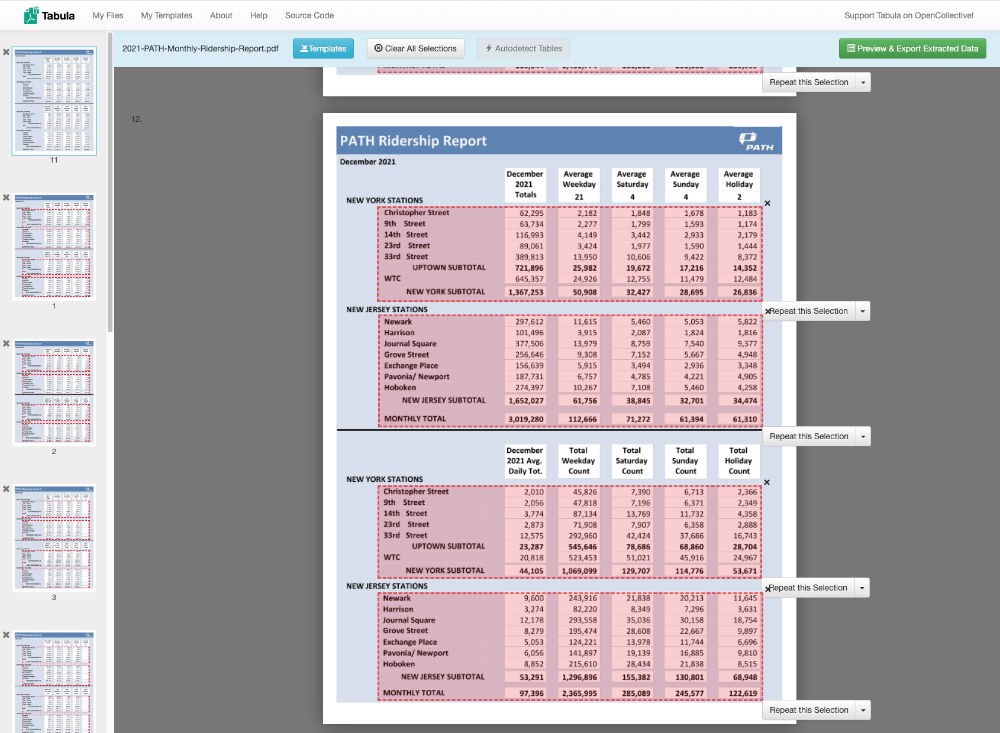

# PATH ridership stats
Cleaned + Plotted PATH ridership data ([source][PA data])

Interactive versions of the plots below:
- [ire.runsascoded.com/#gl=hudcostreets/path-data/-/main/months.ipynb](https://ire.runsascoded.com/#gl=hudcostreets/path-data/-/main/months.ipynb)
- [path.hudcostreets.org](https://path.hudcostreets.org/)

Contents:
<!-- toc -->
- [Cleaned data](#data)
    - [Jan 2012 – Apr 2025](#weekdays)
    - [Closer look at 2020-Present](#weekdays_2020)
    - [Weekends only](#weekends)
    - [Weekends (2020-Present)](#weekdays_2020)
    - [Weekdays, Grouped by Month](#weekday_month_grouped)
    - [Weekends, Grouped by Month](#weekend_month_grouped)
    - [Weekdays vs. Weekends](#week_end_cmp)
    - [Weekdays vs. Weekends, compared to 2019](#week_end_cmp_pct)
- [Usage](#usage)
    - [Update PATH Monthly Data PDFs](#path-data)
        - [0. Install](#install)
        - [1. Download PATH Ridership Reports](#download-data)
        - [2. Process each year's data, output `.pqt`s](#process-data)
        - [3. Combine all years' data](#combine-data)
    - [Bridge & Tunnel Data (WIP)](#bridge_tunnel)
<!-- /toc -->

## Cleaned data <a id="data"></a>
- [`data/all.pqt`]

### Jan 2012 – Apr 2025 <a id="weekdays"></a>


### Closer look at 2020-Present <a id="weekdays_2020"></a>


### Weekends only <a id="weekends"></a>


### Weekends (2020-Present) <a id="weekdays_2020"></a>


### Weekdays, Grouped by Month <a id="weekday_month_grouped"></a>


### Weekends, Grouped by Month <a id="weekend_month_grouped"></a>


### Weekdays vs. Weekends <a id="week_end_cmp"></a>


### Weekdays vs. Weekends, compared to 2019 <a id="week_end_cmp_pct"></a>


As of April 2025:
- weekday ridership was 71.2% of April '19 (pre-COVID)
- weekend ridership was 99.6% of April '19 (pre-COVID)

## Usage <a id="usage"></a>

### Update PATH Monthly Data PDFs <a id="path-data"></a>

#### 0. Install <a id="install"></a>
```bash
git clone https://github.com/hudcostreets/path
cd path
pip install -e .
```

#### 1. Download PATH Ridership Reports <a id="download-data"></a>

```bash
path-data refresh
```

- [`refresh.py`](path_data/cli/refresh.py)
- Updates local copies of [PANYNJ PDFs][PA data], e.g.:
  - [2024-PATH-Monthly-Ridership-Report.pdf]
  - [2024-PATH-Hourly-Ridership-Report.pdf]

##### 1b. Create [Tabula] templates

This is already done, the resulting templates are saved in [`templates/`](templates).



#### 2. Process each year's data, output `.pqt`s <a id="process-data"></a>
```bash
path-data update
```

- [`update.py`](path_data/cli/update.py)
- [`monthly.ipynb`](monthly.ipynb)
- Outputs[`data/20*.pqt`](data/)


#### 3. Combine all years' data <a id="combine-data"></a>

```bash
path-data combine
```
- [`combine.py`](path_data/cli/combine.py)
- [`months.ipynb`](months.ipynb)
- Outputs: [`data/all.pqt`], [`img/weekdays.png`](img/weekdays.png), etc.

### Bridge & Tunnel Data (WIP) <a id="bridge_tunnel"></a>

Merge per-year PDFs into one:
```bash
/opt/homebrew/bin/gs \
  -o merged.pdf \
  -sDEVICE=pdfwrite \
  -dPDFFitPage \
  -g12984x10033 \
  -dPDFSETTINGS=/prepress \ 
  traffic-e-zpass-usage-20*
```
cf. [SO](https://stackoverflow.com/a/28455147/544236).


[`data/all.pqt`]: data/all.pqt
[Tabula]: https://tabula.technology/
[PA data]: https://www.panynj.gov/path/en/about/stats.html
[2024-PATH-Monthly-Ridership-Report.pdf]: data/2024-PATH-Monthly-Ridership-Report.pdf
[2024-PATH-Hourly-Ridership-Report.pdf]: data/2024-PATH-Hourly-Ridership-Report.pdf
